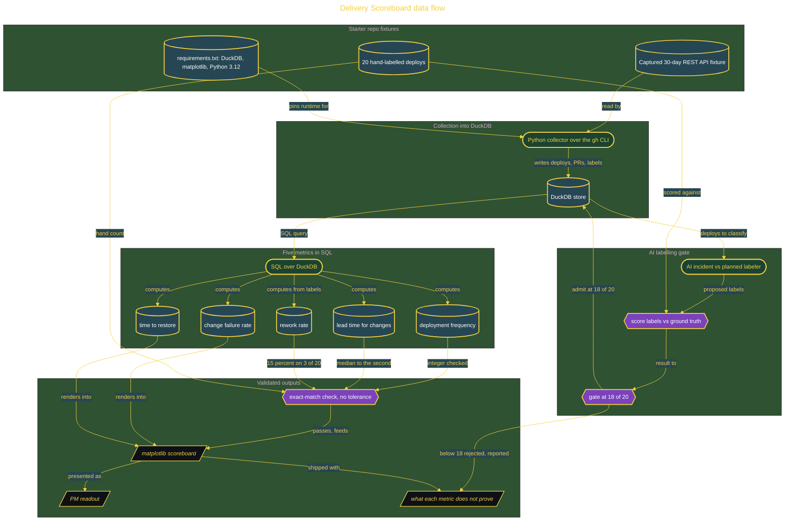

# The Delivery Scoreboard: Four Keys From Your Own Repo

> Inside the [Build & Brew: The AI Dojo](../../README.md) cohort · *A 45-minute live build toward the high-performing solutions engineer.*

## Overview

The quarterly review just ended. The product manager keeps telling leadership the team is elite, but when someone asked what elite means, the PM had no number. The ask is plain: build a scoreboard from the team's own repo, and say straight what each number does not prove.

This build computes the four DORA keys, deployment frequency, lead time for changes, change failure rate, and time to restore, plus rework rate added in the 2024 report, from the repo's own git and history rather than a hosted product. A Python collector reads a captured 30-day fixture of the GitHub REST API responses into DuckDB, SQL computes the metrics, and matplotlib renders the scoreboard. The definitions follow the current DORA spec and its seven team archetypes, not the retired low-to-elite tiers. The AI labels each deploy incident-versus-planned so rework rate is computable from messy history, but it never sets a number, and its labels are scored against 20 hand-labelled deploys and admitted only at 18 of 20.

What it proves is narrow and honest: the team can compute its own delivery numbers from evidence it owns and state them against the current DORA model. What it does not prove ships in a one-page note. The numbers are not judged good, and nothing here modernizes any system. The scoreboard measures delivery, it does not fix it.

Primary role: DevOps and DevSecOps. Tier: Foundation. It is one live build, budgeted to 45 minutes, with the seeded history and ground truth pre-staged so the session buys the collector and the metric argument, not the corpus.

## Architecture

Every number comes off timestamps the team can hand-count: the collector loads the captured fixture into DuckDB, SQL computes the five metrics, and the AI only classifies incident-versus-planned once its labels clear the 18 of 20 gate.

## Implementation

1. Open the kickoff Issues on the GitHub Project board, then draft the requirements brief, the four MADR decision records, and the Mermaid data-flow diagram with the AI and correct them by hand (8 minutes).
2. Run the Python collector to read the captured 30-day GitHub REST API fixture for deploys, pull requests, and incident labels, and write them into DuckDB (9 minutes).
3. Run SQL over DuckDB to compute deployment frequency, lead time for changes, change failure rate, time to restore, and rework rate (8 minutes).
4. Have the AI label each deploy incident-versus-planned, score the labels against the 20 hand-labelled deploys, and admit them into the metric only at 18 of 20 (7 minutes).
5. Render the scoreboard with matplotlib and validate the numbers against the hand-counted ground truth exactly (7 minutes).
6. Present the readout to the PM, write the teach-back one-pager and the after-action review, close every Issue by pull request, and tag the release (6 minutes).

## Validation

- ✅ Deployment frequency matches the hand-counted integer exactly against the seeded 30-day history.
- ✅ Median lead time for changes matches the hand-counted value to the second, with no tolerance band.
- ✅ Three incident-triggered deploys out of twenty return a rework rate of exactly 15 percent.
- ✅ The AI incident-versus-planned labels score at least 18 of 20 against the hand-labelled deploys before they enter the metric.
- ✅ Negative test: a run below 18 of 20 is rejected and reported as its count, and must not move rework rate.
- ✅ Every figure traces to a row in DuckDB, which is what makes the exact-match check possible.
- ✅ A one-page note ships stating what each metric does and does not prove, including that nothing here modernizes any system.
