# DORA Delivery Scoreboard with DuckDB

> Inside the [Build & Brew: The AI Dojo](../../README.md) cohort · *A live build toward the high-performing solutions engineer.*

## Overview

A delivery metric that nobody can trace is a number with a logo on it. This build computes the five DORA measures over 30 days of history with DuckDB and Python, defining each one in SQL so every figure on the scoreboard has a path back to the rows it came from, and shipping the result as a self-contained offline HTML page that states what the records cannot prove alongside what they do.

The design decision came first and named its own exit. ADR-001 chose a captured JSON corpus of 20 deployments, incident reports, and sealed labels over calling a live repository API, because a fixed input means a changed result points at the code rather than at moving repository state, and it sidesteps auth, pagination, and rate limits that prove nothing about the metric definitions. The cost is freshness, so the reversal trigger is written down: the moment the scoreboard becomes a recurring job that must reflect live state, a live collector or a scheduled cache becomes necessary.

Two findings carry the build. The same 20 deployments return a lead time of 26.0h, 18.0h, or 1.0h depending on whether the clock starts at commit, PR open, or merge, and the 1.0h version looks fastest precisely because it hides everything before merge, so a metric name alone is never comparable across teams. And the AI gate that classifies incident-triggered rework runs two checks rather than one, matching every record against the sealed labels at 20 of 20 and the true count at 3 of 3, because two files can each hold 20 rows and still disagree about which three deployments were incident response. Both passing is what released the 15.0% rework rate. Pointed at a real repository afterward, the collector produced a lead time of 0.0h only because deploy time had been copied from commit time, and an assertion against the 26.0 reference caught it.

## Architecture

```mermaid
---
title: DORA Delivery Scoreboard with DuckDB
---
%%{init: {"theme":"base","themeVariables": {"primaryColor":"#1B4332","primaryTextColor":"#F4D03F","primaryBorderColor":"#F4D03F","secondaryColor":"#264653","tertiaryColor":"#2F5233","lineColor":"#F4D03F","fontFamily":"ui-monospace, SFMono-Regular, Menlo, Consolas, monospace","fontSize":"13px"}}}%%
flowchart TD
    classDef datastore fill:#264653,stroke:#F4D03F,stroke-width:2px,color:#FFFFFF
    classDef service fill:#1B4332,stroke:#F4D03F,stroke-width:2px,color:#F4D03F
    classDef event fill:#7B42BC,stroke:#F4D03F,stroke-width:2px,color:#FFFFFF
    classDef io fill:#0d1117,stroke:#F4D03F,stroke-width:1.5px,color:#F4D03F,font-style:italic

    Engineer[/Engineer reporting delivery performance/]
    Stakeholder[/Stakeholder reading the scoreboard/]

    subgraph Decision["ADR-001, written before any metric"]
        Captured[(Captured JSON corpus)]
        LiveApi{{Alternative considered: a scheduled API cache}}
        Repeatable{{Chosen for repeatability, no auth, pagination or rate limits}}
        Freshness{{Trade-off: it cannot show current performance}}
        Reverse{{Reversal trigger: when the scoreboard becomes a recurring job needing live state}}
    end

    subgraph Corpus["The fixed dataset"]
        Deploys[(20 deployment records)]
        Incidents[(Incident reports)]
        Sealed[(sealed_labels.json, the scoring authority)]
        Marked[(d-006, d-011, d-015 flagged is_incident_triggered)]
        Signals{{Visible evidence: commit_message starts hotfix, linked_issue_title starts INC-}}
    end

    subgraph Metrics["Five definitions in SQL"]
        Duck(DuckDB over the captured records)
        FiveSql[(Frequency, lead time, fail rate, recovery, rework)]
        Audit{{Every displayed number traces to its SQL rule and rows}}
    end

    subgraph Clock["The clock changes the answer"]
        FromCommit[(Commit start: 26.0h)]
        FromPr[(PR open: 18.0h)]
        FromMerge[(Merge: 1.0h)]
        SameData{{Same 20 deployments, three different answers}}
        Hidden{{1.0h looks fastest and hides everything before merge}}
        DoraDef{{DORA means commit to production, so 26.0h is the metric}}
    end

    subgraph Gate["The AI gate, two checks not one"]
        Classifier(Local AI client labels 20 deployments)
        RowCheck{{Record-level: every ID matches the sealed value, 20 of 20}}
        CountCheck{{Count-level: predicted true count matches sealed, 3 of 3}}
        WhyBoth{{Matching totals alone prove nothing, two files can each hold 20 rows and disagree on which three}}
        Released[(Rework rate released: 3 of 20 is 15.0%)]
    end

    subgraph Real["Secret mission: point it at a real repository"]
        Collector(Real-repository collector)
        Measurable[(deployment_frequency 20, from the git log)]
        FakeZero{{change_lead_time printed 0.0 only because deploy time was copied from commit time}}
        Assertion{{AssertionError against the 26.0 reference caught the meaningless number}}
        Absent{{PR-open and merge clocks missing, no incident records, so fail rate, recovery and rework are unmeasurable}}
    end

    subgraph Readout["The delivered artifact"]
        Html[(Self-contained offline scoreboard.html)]
        CannotProve{{Each metric annotated with what the records cannot prove}}
    end

    Engineer -- "records" --> Captured
    Captured -- "chosen over" --> LiveApi
    Captured -- "because of" --> Repeatable
    Repeatable -- "accepts" --> Freshness
    Freshness -- "bounded by" --> Reverse
    Captured -- "holds" --> Deploys
    Captured -- "holds" --> Incidents
    Captured -- "holds" --> Sealed
    Sealed -- "flags" --> Marked
    Marked -- "corroborated by" --> Signals
    Deploys -- "queried by" --> Duck
    Incidents -- "queried by" --> Duck
    Duck -- "evaluates" --> FiveSql
    FiveSql -- "gives" --> Audit
    Deploys -- "measured from commit gives" --> FromCommit
    Deploys -- "measured from PR open gives" --> FromPr
    Deploys -- "measured from merge gives" --> FromMerge
    FromCommit -- "together demonstrate" --> SameData
    FromMerge -- "together demonstrate" --> SameData
    FromMerge -- "is the trap" --> Hidden
    FromCommit -- "is the one that matches" --> DoraDef
    Classifier -- "predictions tested by" --> RowCheck
    Classifier -- "predictions tested by" --> CountCheck
    Sealed -- "is the authority for" --> RowCheck
    RowCheck -- "insufficient alone, hence" --> WhyBoth
    CountCheck -- "insufficient alone, hence" --> WhyBoth
    RowCheck -- "passing both releases" --> Released
    CountCheck -- "passing both releases" --> Released
    Engineer -- "then points" --> Collector
    Collector -- "measures" --> Measurable
    Collector -- "reports" --> FakeZero
    FakeZero -- "caught by" --> Assertion
    DoraDef -- "is the reference in" --> Assertion
    Collector -- "cannot supply" --> Absent
    Released -- "rendered into" --> Html
    Audit -- "rendered into" --> Html
    Absent -- "recorded as" --> CannotProve
    Hidden -- "recorded as" --> CannotProve
    Html -- "carries" --> CannotProve
    Html -- "handed to" --> Stakeholder
    CannotProve -- "stops a correct number supporting a wrong conclusion for" --> Stakeholder

    class Captured,Deploys,Incidents,Sealed,Marked,FiveSql,FromCommit,FromPr,FromMerge,Released,Measurable,Html datastore
    class Duck,Classifier,Collector service
    class LiveApi,Repeatable,Freshness,Reverse,Signals,Audit,SameData,Hidden,DoraDef,RowCheck,CountCheck,WhyBoth,FakeZero,Assertion,Absent,CannotProve event
    class Engineer,Stakeholder io
```

The diagram shows the topology and data flow of the system as built. The full architectural narrative, with screenshots and prose, lives in [`documents/dora-delivery-scoreboard.md`](./documents/dora-delivery-scoreboard.md).

## Implementation

This system is built across **7 phases**:

1. What This Project Is About
2. Setting Up the Project and Writing Design Documents
3. Building the Captured Corpus
4. Defining Five Metrics in SQL
5. Running the AI Gate for Rework Rate
6. Annotating the Readout and Closing the Folder
7. Measuring a Real Repository

For the full walkthrough with screenshots and step-by-step content, see [`documents/dora-delivery-scoreboard.md`](./documents/dora-delivery-scoreboard.md).

## Validation

Each build phase below is documented in [`documents/dora-delivery-scoreboard.md`](./documents/dora-delivery-scoreboard.md), with screenshots, configuration, and notes as captured during the build:

- ✅ What This Project Is About
- ✅ Setting Up the Project and Writing Design Documents
- ✅ Building the Captured Corpus
- ✅ Defining Five Metrics in SQL
- ✅ Running the AI Gate for Rework Rate
- ✅ Annotating the Readout and Closing the Folder
- ✅ Measuring a Real Repository
