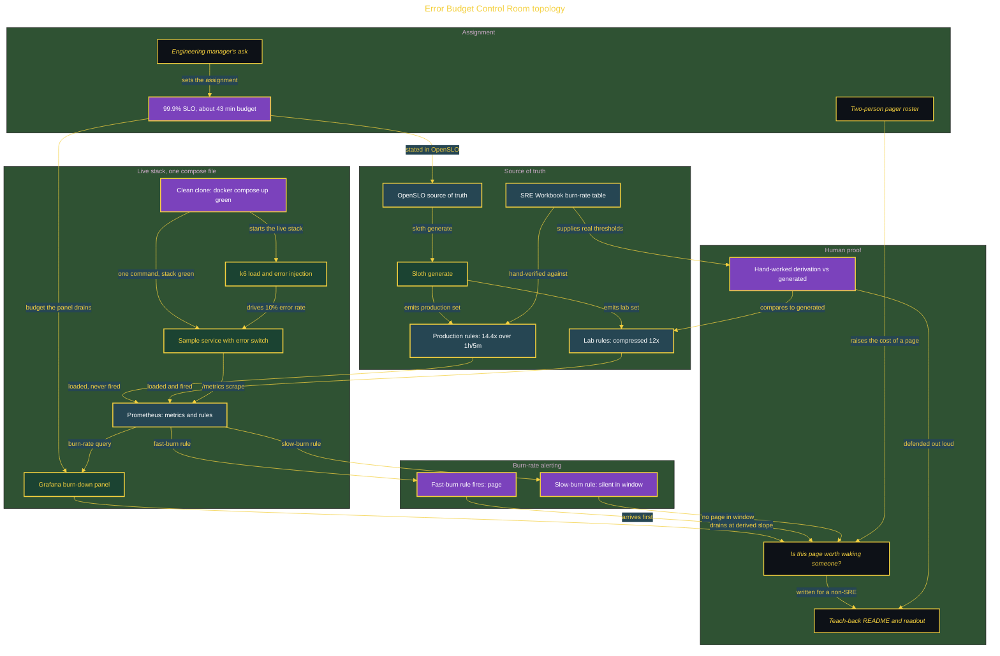

# Error Budget Control Room: Prove a Page Is Worth Waking Someone

> Inside the [Build & Brew: The AI Dojo](../../README.md) cohort · *A 45-minute live build toward the high-performing solutions engineer.*

## Overview

The incident review just ended. Two people carry the pager for this service, and both were awake last night for an alert that resolved itself before either finished logging in. The engineering manager wants the pages made defensible, not quieter: a number that says whether a given page was worth waking someone, and the derivation behind it. If it cannot be derived in front of her, it does not belong in the runbook.

This build turns a service level objective into an error budget and the burn-rate rules that decide whether a page is worth a human. It produces an availability SLI written as good events over valid events, an SLO of 99.9 percent over thirty days with its budget of about 43 minutes a month, two multiwindow multi-burn-rate rule sets generated from one OpenSLO source (a fast page and a slower rule), a Grafana burn-down panel, and a hand-worked derivation a person can defend out loud. It proves the arithmetic by replaying an incident: a page that resolved itself before anyone logged in.

The primary role is Site Reliability Engineering at Cohort tier, delivered as one live 45-minute build. The lab runs on compressed observation windows, because a one-hour burn window does not fit inside the session, and it says so: the production rule set carries the SRE Workbook's real thresholds and is hand-verified and never fired, while the lab set holds the identical burn-rate multipliers and window ratio at a twelvefold compression.

## Architecture

One OpenSLO document is the single source: Sloth generates both rule sets from it, k6 drives errors into the sample service, Prometheus scrapes it and evaluates the rules, and the fast-burn alert, the slow-burn alert, and the Grafana burn-down panel together answer whether the page was worth waking someone, with the hand-worked derivation verifying the thresholds against the SRE Workbook table.

## Implementation

1. Confirm the day-zero gate, run `docker compose up` to bring Prometheus, Grafana, Sloth, k6, and the sample service green, open the GitHub Projects board with one epic and five issues, and let the AI draft three of the four decision records from the stated constraints, corrected by hand.
2. Define the availability indicator as good events over valid events, argue the denominator out loud (valid excludes health checks and client cancellations), and reject one AI candidate SLI in writing.
3. Write the OpenSLO document at the openslo/v1alpha version and run Sloth to generate both the production and lab rule sets from that single source.
4. Derive the burn-rate thresholds by hand against the SRE Workbook table in `reference/workbook-burnrate-table.md` and compare them to the generated output, treating any mismatch as a finding.
5. Drive a sustained ten percent error rate with k6 so the scaled fast-burn rule pages, the scaled slow rule stays silent, and the Grafana burn-down panel drains.
6. Produce the three-slide error-budget policy readout and the teach-back README explaining burn rate to a non-SRE, close each issue by pull request carrying `Closes #n`, tag the release, and finish the docs.

## Validation

✅ From a clean clone, one command (`docker compose up`) brings the whole stack green (AC-1).
✅ At a sustained ten percent error rate, the scaled fast-burn rule fires exactly once inside its five-minute long window (AC-2).
✅ The scaled slow rule has not fired inside that window, because its thirty-minute window has not yet elapsed (AC-3).
✅ The Grafana burn-down panel drains within ten percent of the slope the hand-worked derivation predicted (AC-4).
✅ The hand-worked derivation shows the production 14.4x multiplier over a one-hour long window and the lab scaling factor side by side and states in one sentence why they are the same rule.
✅ The production rule set is hand-verified against the SRE Workbook table and never fired, while the lab set holds the identical multipliers and long-to-short window ratio at a twelvefold compression.
✅ The AI is scored, not just used: the readout reports how many of three candidate SLIs were rejected as unmeasurable and how many of six generated values the hand-derivation contradicted, and a zero on both is reported as the finding.
