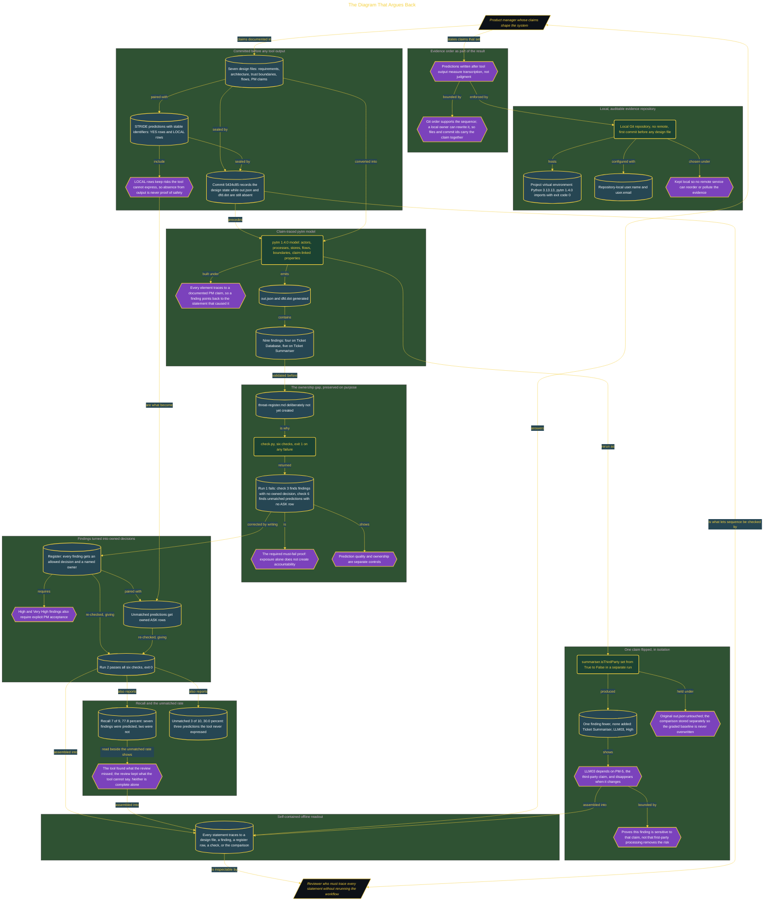

# The Diagram That Argues Back

> Inside the [Build & Brew: The AI Dojo](../../README.md) cohort · *A live build toward the high-performing solutions engineer.*

## Overview

A threat model that a product manager has to take on faith is a diagram, not evidence. This build answers the PM with a package that can be checked without the builder in the room: which design claims survived analysis, which STRIDE predictions matched the generated findings, and which residual risks still need an owner. Evidence order is treated as part of the result, because a prediction written after reading tool output measures transcription rather than judgment.

So the design went into a local Git repository first. Seven design files and a prediction set with stable identifiers were committed at `5434c85` while `out.json` and `dfd.dot` did not yet exist, and the doc is honest that a local owner can rewrite history, so the retained files and the commit id carry the claim together. The predictions include LOCAL rows for risks the tool cannot express, so absence from output is never read as safety. Only then was the pytm 1.4.0 model built, every element traced to its PM claim, and run to nine findings across the ticket database and the summariser.

The ownership gap is the lesson. The threat register was deliberately not written before the first validation, so `check.py` failed with exit code 1 on findings with no owned decision and predictions with no ASK row. That must-fail proof shows exposure alone does not create accountability. Once every finding had an allowed decision and a named owner, High and Very High items carried explicit PM acceptance, and unmatched predictions got owned ASK rows, the second run passed all six checks and reported **recall 7 of 9** and an **unmatched rate of 3 of 10**: the tool found two threats the review missed, and the review kept three the tool cannot say. A claim-flip in an isolated run, `isThirdParty` from True to False, removed exactly one finding, LLM03, proving it hangs on PM-5 and nothing else.

## Architecture

The diagram shows the topology and data flow of the system as built. The full architectural narrative, with screenshots and prose, lives in [`documents/evidence-first-threat-model.md`](./documents/evidence-first-threat-model.md).

## Implementation

This system is built across **6 phases**:

1. Committing to an Evidence-First Threat Model
2. Preparing a Local, Auditable Evidence Repository
3. Committing PM Claims Before Tool Output
4. Building the Threat Model and Preserving the Ownership Gap
5. Turning Findings into Owned Decisions
6. Testing Claim Sensitivity and Shipping the Readout

For the full walkthrough with screenshots and step-by-step content, see [`documents/evidence-first-threat-model.md`](./documents/evidence-first-threat-model.md).

## Validation

Each build phase below is documented in [`documents/evidence-first-threat-model.md`](./documents/evidence-first-threat-model.md), with screenshots, configuration, and notes as captured during the build:

- ✅ Committing to an Evidence-First Threat Model
- ✅ Preparing a Local, Auditable Evidence Repository
- ✅ Committing PM Claims Before Tool Output
- ✅ Building the Threat Model and Preserving the Ownership Gap
- ✅ Turning Findings into Owned Decisions
- ✅ Testing Claim Sensitivity and Shipping the Readout
