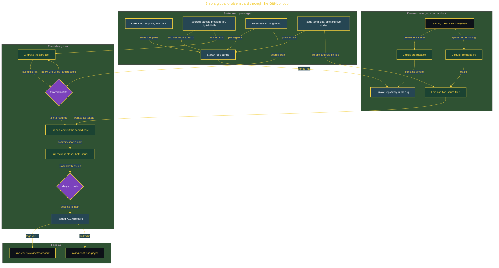

# Your First Rep: Ship a Global-Problem Card Through GitHub

> Inside the [Build & Brew: The AI Dojo](../../README.md) cohort · *A 45-minute live build toward the high-performing solutions engineer.*

## Overview

On your first day, a group lead catches you: everyone here builds real things and ships them like a real team, so before touching anything hard, prove you can run the loop. Put a tiny thing in a repository inside the organization, track it on a board, work it through a pull request, and tag a release. Pick a real problem worth a one-page card, and be honest on the card about what it does not fix. A learner who has never worked the real delivery loop cannot ship anything the way a team does, so the first ranked build would lose its time to setup instead of the lesson. Project 00 teaches the loop once, on a build small enough that the loop is the only thing to learn.

What ships is one Global-Problem Card: a single Markdown file with four parts, a headline, the problem in plain words, a sourced number with its citation, and an honest line on what a card like this does not fix. It travels the full GitHub loop, a private repository inside the organization, a Project board, two issues worked as tickets, a branch, a pull request that closes both issues, and a tagged v0.1.0 release. The AI drafts the card text; the learner scores that draft against a three-item rubric and edits it to 3 of 3 before it merges, so the human owns the final words and the AI is measured rather than trusted.

What it proves is transferable: you can take a real, sourced problem and ship a clear, honest artifact about it through the same rails a real team uses. The primary role is the delivery loop itself, the forward-deployed and DevOps habits, an issue to a branch to a pull request to a merge to a tagged release, that every later build reuses. This is the warm-up before the ranked builds, run in one live session.

The honest line, stated on the card and not hidden: about 2.2 billion people are still offline in 2025, roughly a quarter of humanity, per the International Telecommunication Union, the United Nations agency for information and communication technology. Nothing in this first rep connects one of them. It builds the habit of shipping a clear, sourced, honest artifact through real engineering rails, which is the one skill every later build depends on.

## Architecture

The card starts as a sourced sample problem in the pre-staged starter repo, is drafted by the AI and held at the rubric gate until it scores 3 of 3, then travels the loop from a tracked issue to a branch, a pull request that closes both issues, a merge to main, and a tagged v0.1.0 release that the teach-back and stakeholder readout hand over.

## Implementation

1. Create a private repository inside the GitHub organization, open a GitHub Project board, and file the epic and its two issues from the issue templates before any card is written.
2. Have the AI draft the card text in Markdown from the sourced sample problem, using a small Gemma 3 model in Ollama or a flat-rate AI client, then score the draft against the three-item rubric and edit it to 3 of 3.
3. Work a branch: commit the scored CARD.md, open a pull request that closes both issues with a closing keyword for each, and merge it to main.
4. Tag the v0.1.0 release with the gh CLI, then confirm the repository, board, issues, pull request and release all exist.
5. Present the card to a stakeholder in two lines, write the teach-back one-pager and the after-action review, and close the repository with its README present.

## Validation

- ✅ The card carries all three required parts: the problem stated plainly, the sourced number with its citation, and an explicit line on what it does not fix.
- ✅ The repository lives inside the GitHub organization, not a personal account.
- ✅ Both issues on the board are closed by one pull request that carries each issue number.
- ✅ A v0.1.0 release is tagged, and the repository, board, issues, pull request and release all exist.
- ✅ The AI card draft scores 3 of 3 against the three-item rubric before the card is merged.
- ✅ A draft below 3 of 3 fails the gate: it is edited and rescored, not shipped.
- ✅ The sourced number matches its citation: about 2.2 billion people offline in 2025, per the International Telecommunication Union.
- ✅ The teach-back one-pager lets someone who has never seen the repository run the same loop from issue to release.
