# Prove an IAM Permissions Boundary

> Inside the [Build & Brew: The AI Dojo](../../README.md) cohort · *A live build toward the high-performing solutions engineer.*

## Overview

Attaching a permissions boundary and calling the role safe is an assumption, not a control. This build treats the boundary as something that has to be tested, and answers one security lead's question: can a widened local policy still grant `iam:CreatePolicyVersion` once the approved ceiling is attached? That action matters because creating a new managed-policy version is how a role edits policy content past its intended permission set.

The design is what makes the answer trustworthy. Eight predicted decisions were frozen in a CSV before the simulator ran, and treated as immutable once output existed, so an unexpected result could not be quietly rewritten into a success. The ceiling, the disputed widening, and the predictions were kept as three separate inputs so every result traces back to one of them. A control condition ran first: with no boundary attached, the simulator returned **allowed** for the disputed action, which is what makes the later refusal a measured change rather than something that was never reachable. Attachment was then proven by a fresh `get-role` read returning the boundary ARN, not inferred from a filename or a command transcript.

Four outcomes were kept apart instead of collapsed into one denied label, and that separation is the real lesson. Five privileged mutations returned explicit deny, showing refusal overrides any matching allow. `iam:ListUsers` returned implicit deny because no allow existed to match, proving a boundary limits authority and cannot grant what the policy omits. The disputed action was refused with `AllowedByPermissionsBoundary` false, while `iam:GetRole` was allowed because both sides permitted it. That is intersection semantics made visible. The run scored **8 of 8** against the frozen predictions, though the ordering of the evidence weighs more than the number, since a perfect score written afterwards proves nothing. Teardown was an acceptance criterion rather than cleanup: resources came out in dependency order and fresh reads returned `NoSuchEntity` for both identities.

## Architecture

```mermaid
---
title: Prove an IAM Permissions Boundary
---
%%{init: {"theme":"base","themeVariables": {"primaryColor":"#1B4332","primaryTextColor":"#F4D03F","primaryBorderColor":"#F4D03F","secondaryColor":"#264653","tertiaryColor":"#2F5233","lineColor":"#F4D03F","fontFamily":"ui-monospace, SFMono-Regular, Menlo, Consolas, monospace","fontSize":"13px"}}}%%
flowchart TD
    classDef datastore fill:#264653,stroke:#F4D03F,stroke-width:2px,color:#FFFFFF
    classDef service fill:#1B4332,stroke:#F4D03F,stroke-width:2px,color:#F4D03F
    classDef event fill:#7B42BC,stroke:#F4D03F,stroke-width:2px,color:#FFFFFF
    classDef io fill:#0d1117,stroke:#F4D03F,stroke-width:1.5px,color:#F4D03F,font-style:italic

    SecurityLead[/Security lead asking whether the ceiling holds/]
    Reviewer[/Reviewer who must reconstruct the proof without the summary/]

    subgraph Question["The question, framed before anything ran"]
        Ask{{Can a widened local policy grant CreatePolicyVersion once the boundary is attached?}}
        WhyMatters{{A new managed-policy version lets a role expand policy content past its intended set}}
        NotAssumed{{A boundary is treated as a testable control, not as safety proven by its presence}}
    end

    subgraph Frozen["Inputs sealed before execution"]
        Boundary[(boundary.json, the approved ceiling)]
        Widened[(widened.json, the disputed local allowance)]
        Predictions[(predictions.csv, eight decisions written first)]
        Immutable{{Treated as immutable once simulator output existed}}
        NoRewrite{{So an unexpected decision cannot be rewritten into an apparent success}}
        Manifest[(check-manifest listing checks 1 through 6 only)]
    end

    subgraph Workspace["Local evidence workspace"]
        Cli(AWS CLI and Git verified)
        NonRoot{{Non-root local session confirmed}}
        Repo[(Dedicated repository versioning inputs, outputs and notes)]
        TwoTrusts{{Local admin access is not AWS authority, kept as separate trust boundaries}}
    end

    subgraph Unbounded["Control condition, no ceiling attached"]
        Role(Temporary BoundaryProofRole created from frozen JSON)
        SimBefore("simulate-principal-policy, before attachment")
        AllowedBefore[(CreatePolicyVersion: allowed)]
        Establishes{{Proves the widening COULD grant the action when unbounded}}
        SimOnly{{A simulation, never a live mutation: no policy version was created}}
    end

    subgraph Attach["Attaching the approved ceiling"]
        PutBoundary("put-role-permissions-boundary")
        GetRole("Fresh get-role read")
        ArnMatch[(PermissionsBoundaryArn returned, matching the created policy)]
        WhyRead{{Configuration proven by AWS returning the ARN, not inferred from a filename or transcript}}
    end

    subgraph Four["Four outcomes, deliberately not collapsed"]
        Explicit[(explicitDeny on five privileged mutations)]
        Implicit[("implicitDeny on ListUsers: no applicable allow existed")]
        Refused[(CreatePolicyVersion refused, AllowedByPermissionsBoundary false)]
        Allowed[(GetRole allowed, permitted by both)]
        Intersection{{Effective authority exists only where identity policy and boundary both allow}}
        CannotGrant{{A boundary limits maximum authority and cannot grant what the policy omits}}
        DenyWins{{An explicit deny stays decisive over any matching allow}}
    end

    subgraph Score["The graded result"]
        EightOfEight[(8 of 8 observed decisions matched the frozen predictions)]
        Ordering{{The value is the ordering of evidence, not the number: a perfect score written afterwards proves little}}
    end

    subgraph Teardown["Cleanup as an acceptance criterion"]
        Order("Removed in dependency order: boundary, policy, role, then the ceiling")
        NotErrors{{Dependency errors are not accepted as evidence that cleanup worked}}
        FreshReads("Fresh get-role and get-policy against the exact identities")
        NoSuchEntity[(NoSuchEntity returned for both)]
        ScopedClaim{{Proves the two named resources are absent, never that the account matches an earlier baseline}}
    end

    subgraph Optional["Optional work held outside the seal"]
        Analyzer(IAM Access Analyzer checks)
        Prefixed{{Filed under an optional prefix and excluded from the manifest}}
        Uncommitted{{Left uncommitted at the v1.0.0 tag, so the tag still identifies the sealed post-teardown proof}}
        Cost[("Graded path 0.00 USD; one paid comparison at 0.002 USD recorded separately")]
    end

    SecurityLead -- "asks" --> Ask
    Ask -- "matters because" --> WhyMatters
    Ask -- "answered under" --> NotAssumed
    Ask -- "specified as" --> Predictions
    Boundary -- "kept distinct from" --> Widened
    Predictions -- "governed by" --> Immutable
    Immutable -- "prevents" --> NoRewrite
    Predictions -- "scoped by" --> Manifest
    Cli -- "run from" --> NonRoot
    Cli -- "records into" --> Repo
    NonRoot -- "bounded by" --> TwoTrusts
    Repo -- "versions" --> Boundary
    Repo -- "versions" --> Widened
    Repo -- "versions" --> Predictions
    Widened -- "attached to" --> Role
    Role -- "evaluated by" --> SimBefore
    SimBefore -- "returned" --> AllowedBefore
    AllowedBefore -- "establishes" --> Establishes
    AllowedBefore -- "bounded by" --> SimOnly
    Boundary -- "applied by" --> PutBoundary
    PutBoundary -- "applied to" --> Role
    PutBoundary -- "verified by" --> GetRole
    GetRole -- "returned" --> ArnMatch
    ArnMatch -- "is why configuration is proven, per" --> WhyRead
    ArnMatch -- "ties the ceiling to the checks producing" --> Refused
    Role -- "re-evaluated after attachment, giving" --> Explicit
    Role -- "re-evaluated after attachment, giving" --> Implicit
    Role -- "re-evaluated after attachment, giving" --> Refused
    Role -- "re-evaluated after attachment, giving" --> Allowed
    Refused -- "against AllowedBefore is the measured change proving" --> Intersection
    Allowed -- "together demonstrate" --> Intersection
    Implicit -- "demonstrates" --> CannotGrant
    Explicit -- "demonstrates" --> DenyWins
    Predictions -- "compared row by row against the four outcomes gives" --> EightOfEight
    EightOfEight -- "earns its weight from" --> Ordering
    NoRewrite -- "is what makes Ordering true" --> Ordering
    Role -- "removed by" --> Order
    Order -- "run under" --> NotErrors
    Order -- "followed by" --> FreshReads
    FreshReads -- "returned" --> NoSuchEntity
    NoSuchEntity -- "supports only" --> ScopedClaim
    Analyzer -- "filed under" --> Prefixed
    Prefixed -- "excluded by" --> Manifest
    Analyzer -- "held out by" --> Uncommitted
    Analyzer -- "priced in" --> Cost
    Uncommitted -- "keeps the seal clean around" --> EightOfEight
    EightOfEight -- "handed with the inputs to" --> Reviewer
    NoSuchEntity -- "handed with the inputs to" --> Reviewer
    Repo -- "is what lets the proof be rebuilt by" --> Reviewer

    class Boundary,Widened,Predictions,Manifest,Repo,AllowedBefore,ArnMatch,Explicit,Implicit,Refused,Allowed,EightOfEight,NoSuchEntity,Cost datastore
    class Cli,Role,SimBefore,PutBoundary,GetRole,Order,FreshReads,Analyzer service
    class Ask,WhyMatters,NotAssumed,Immutable,NoRewrite,NonRoot,TwoTrusts,Establishes,SimOnly,WhyRead,Intersection,CannotGrant,DenyWins,Ordering,NotErrors,ScopedClaim,Prefixed,Uncommitted event
    class SecurityLead,Reviewer io
```

The diagram shows the topology and data flow of the system as built. The full architectural narrative, with screenshots and prose, lives in [`documents/iam-permissions-boundary-proof.md`](./documents/iam-permissions-boundary-proof.md).

## Implementation

This system is built across **7 phases**:

1. Proving the Permissions Boundary Held the Security Ceiling
2. Demonstrating the Unbounded Widening Risk
3. Sealing the Evidence with Verified Teardown
4. Freezing an Auditable Security Decision
5. Establishing a Trusted Local Evidence Workspace
6. Framing the Security Lead's Question
7. Keeping Optional Analysis Outside the Graded Proof

For the full walkthrough with screenshots and step-by-step content, see [`documents/iam-permissions-boundary-proof.md`](./documents/iam-permissions-boundary-proof.md).

## Validation

Each build phase below is documented in [`documents/iam-permissions-boundary-proof.md`](./documents/iam-permissions-boundary-proof.md), with screenshots, configuration, and notes as captured during the build:

- ✅ Proving the Permissions Boundary Held the Security Ceiling
- ✅ Demonstrating the Unbounded Widening Risk
- ✅ Sealing the Evidence with Verified Teardown
- ✅ Freezing an Auditable Security Decision
- ✅ Establishing a Trusted Local Evidence Workspace
- ✅ Framing the Security Lead's Question
- ✅ Keeping Optional Analysis Outside the Graded Proof
