# Build an Observable Health-Check Service

> Inside the [Build & Brew: The AI Dojo](../../README.md) cohort · *A live build toward the high-performing solutions engineer.*

## Overview

A service that answers "am I healthy?" with one endpoint is answering the wrong question. This build separates the two operational decisions an orchestrator actually makes: `/livez` reports whether the Flask process can answer at all, and `/readyz` reports whether the service can currently serve traffic that depends on its backing store. The two endpoints follow genuinely different code paths, and the whole build exists to prove that difference holds under a real dependency failure.

The central contract is proven, not asserted. With the store killed, `/readyz` fails its TCP connection and returns HTTP 503 with `not_ready / store unreachable`, while `/livez` keeps returning HTTP 200 with `{"status":"alive"}` because it never opens a socket. That is what stops a temporary store outage from becoming a restart storm: the orchestrator pulls the instance out of rotation and leaves the process alive long enough for the dependency to come back.

Design came before code. The model drafted a requirements brief, four ADRs, a C4 container view, and a build plan, and the review caught the failure mode these designs usually carry: collapsing both signals into one `/health` route, or putting a dependency check inside liveness. ADR-01 was corrected so the contract could not be misread, and a combined `/health` endpoint was explicitly rejected. Configuration is environment-driven (`STORE_HOST`, `STORE_PORT`, `TRACE_FILE`, `SERVICE_PORT`), the app fails immediately when a required variable is missing, and OpenTelemetry spans are written to a local JSON-lines file rather than a vendor agent, so tracing adds no external runtime dependency. A graceful shutdown drain closes it out: SIGINT flips readiness to 503 while liveness holds 200 for two seconds, giving the orchestrator a window to stop sending traffic before the process exits.

## Architecture

```mermaid
---
title: Observable Health-Check Service
---
%%{init: {"theme":"base","themeVariables": {"primaryColor":"#1B4332","primaryTextColor":"#F4D03F","primaryBorderColor":"#F4D03F","secondaryColor":"#264653","tertiaryColor":"#2F5233","lineColor":"#F4D03F","fontFamily":"ui-monospace, SFMono-Regular, Menlo, Consolas, monospace","fontSize":"13px"}}}%%
flowchart TD
    classDef datastore fill:#264653,stroke:#F4D03F,stroke-width:2px,color:#FFFFFF
    classDef service fill:#1B4332,stroke:#F4D03F,stroke-width:2px,color:#F4D03F
    classDef event fill:#7B42BC,stroke:#F4D03F,stroke-width:2px,color:#FFFFFF
    classDef io fill:#0d1117,stroke:#F4D03F,stroke-width:1.5px,color:#F4D03F,font-style:italic

    Engineer[/Engineer proving a health contract/]
    Orchestrator[/Orchestrator deciding restart vs drain/]

    subgraph Design["Design before code"]
        Brief[(Requirements brief)]
        ADRs[(Four ADRs)]
        C4[(C4 container view)]
        Conflation{{AI conflated liveness and readiness}}
        ADR01{{ADR-01 corrected: combined /health rejected}}
    end

    subgraph Setup["Standing rules and config"]
        Rules[(standing-rules.md: Twelve-Factor, endpoint contract)]
        EnvVars[(STORE_HOST, STORE_PORT, TRACE_FILE, SERVICE_PORT)]
        FailFast{{App exits immediately on missing config}}
        Ignore{{.gitignore keeps .key/ and traces.jsonl out of source}}
    end

    subgraph App["Flask service"]
        Livez(/livez: process only, no socket)
        Readyz(/readyz: TCP to store, 1s timeout)
        Otel(OpenTelemetry instrumentation)
    end

    subgraph Deps["Backing service"]
        Store[(store.py, killable TCP process)]
        Traces[(traces.jsonl, local spans)]
    end

    subgraph Drill["Kill drill"]
        KillStore(Stop the store)
        ReadyFail{{/readyz returns 503, store unreachable}}
        LiveHold{{/livez holds 200, alive}}
        NoRestartStorm{{Dependency failure never reads as process failure}}
    end

    subgraph Drain["Secret mission: graceful drain"]
        Sigint(SIGINT received)
        DrainState{{/readyz 503 draining, /livez 200 for two seconds}}
        FactorIX{{Factor IX proven beyond crash-only shutdown}}
    end

    subgraph Close["Close-out"]
        Readout[(Stakeholder readout from observed results)]
        TeachBack[(Teach-back defending four decisions)]
        Release{{Verified v1.0.0 release}}
    end

    Engineer -- "drafts with AI" --> Brief
    Brief -- "decided in" --> ADRs
    ADRs -- "drawn as" --> C4
    ADRs -- "review catches" --> Conflation
    Conflation -- "corrected into" --> ADR01
    ADR01 -- "binds the shape of" --> Livez
    ADR01 -- "binds the shape of" --> Readyz
    Rules -- "sets expectations for" --> App
    EnvVars -- "configures" --> App
    EnvVars -- "absent value triggers" --> FailFast
    Rules -- "enforced by" --> Ignore
    Readyz -- "opens TCP to" --> Store
    Livez -- "never contacts" --> Store
    Otel -- "instruments requests on" --> App
    Otel -- "writes spans to" --> Traces
    Engineer -- "runs" --> KillStore
    KillStore -- "removes" --> Store
    KillStore -- "observed as" --> ReadyFail
    KillStore -- "observed as" --> LiveHold
    ReadyFail -- "together with" --> NoRestartStorm
    LiveHold -- "together with" --> NoRestartStorm
    NoRestartStorm -- "tells" --> Orchestrator
    Sigint -- "flips readiness first" --> DrainState
    DrainState -- "gives rotation time to" --> Orchestrator
    DrainState -- "proves" --> FactorIX
    ReadyFail -- "evidence for" --> Readout
    Readout -- "defended in" --> TeachBack
    TeachBack -- "closed by" --> Release
    FactorIX -- "included in" --> Release

    class Brief,ADRs,C4,Rules,EnvVars,Store,Traces,Readout,TeachBack datastore
    class Livez,Readyz,Otel,KillStore,Sigint service
    class Conflation,ADR01,FailFast,Ignore,ReadyFail,LiveHold,NoRestartStorm,DrainState,FactorIX,Release event
    class Engineer,Orchestrator io
```

The diagram shows the topology and data flow of the system as built. The full architectural narrative, with screenshots and prose, lives in [`documents/observable-health-check-service.md`](./documents/observable-health-check-service.md).

## Implementation

This system is built across **8 phases**:

1. Understanding the Alive vs Ready Problem
2. Proving the Readiness Contract
3. Building Two Health Endpoints with Genuinely Different Logic
4. Designing with AI Before Writing Code
5. Setting Up the Observable Service Stack
6. Scoring the AI and Delivering the Readout
7. Closing the Project with Defended Decisions
8. Graceful Shutdown Drain

For the full walkthrough with screenshots and step-by-step content, see [`documents/observable-health-check-service.md`](./documents/observable-health-check-service.md).

## Validation

Each build phase below is documented in [`documents/observable-health-check-service.md`](./documents/observable-health-check-service.md), with screenshots, configuration, and notes as captured during the build:

- ✅ Understanding the Alive vs Ready Problem
- ✅ Proving the Readiness Contract
- ✅ Building Two Health Endpoints with Genuinely Different Logic
- ✅ Designing with AI Before Writing Code
- ✅ Setting Up the Observable Service Stack
- ✅ Scoring the AI and Delivering the Readout
- ✅ Closing the Project with Defended Decisions
- ✅ Graceful Shutdown Drain
