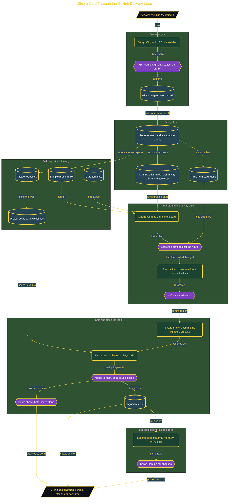

# Ship Your First Card Through GitHub

> Inside the [Build & Brew: The AI Dojo](../../README.md) cohort · *A live build toward the high-performing solutions engineer.*

## Overview

The card is the easy part. This build ships a sourced Global-Problem Card through a full GitHub delivery loop, and the real lesson is the rail system around it: issues, acceptance criteria, rubric checks, a reviewed pull request, and a clean tagged release. Software delivery is not only making an artifact. It is proving how the artifact moved from planned work to finished work, with a trail someone else can inspect.

This is the warm-up rep every later build reuses. The point of view is the high-performing solutions engineer, and the build drills all three cohort reflexes at once: it designs before it builds (requirements, a decision record, and a rubric come first), it proves the result with a fixed rubric rather than a feeling, and it refuses to trust the confident AI answer. The AI drafts the card; the rubric decides whether the draft is allowed to ship.

Primary role: the delivery loop, the DevOps and forward-deployed habits every domain build assumes. It is one live build, with the sample problem, the card template, and the three-item rubric staged so the session spends its attention on the loop, not on setup.

## Architecture

The diagram shows the topology and data flow of the system as built. The full architectural narrative, with screenshots and prose, lives in [`documents/ship-your-first-card-through-github.md`](./documents/ship-your-first-card-through-github.md).

## Implementation

This system is built across **6 phases**:

1. Setting Up the Engineering Environment
2. Designing Before Building
3. Standing Up the Rails and AI-Drafting the Card
4. Scoring the Draft and Enforcing the Quality Gate
5. Shipping the Card and Closing the Loop
6. Proving the Rails Are Reusable

For the full walkthrough with screenshots and step-by-step content, see [`documents/ship-your-first-card-through-github.md`](./documents/ship-your-first-card-through-github.md).

## Validation

Each build phase below is documented in [`documents/ship-your-first-card-through-github.md`](./documents/ship-your-first-card-through-github.md), with screenshots, configuration, and notes as captured during the build:

- ✅ Setting Up the Engineering Environment
- ✅ Designing Before Building
- ✅ Standing Up the Rails and AI-Drafting the Card
- ✅ Scoring the Draft and Enforcing the Quality Gate
- ✅ Shipping the Card and Closing the Loop
- ✅ Proving the Rails Are Reusable
