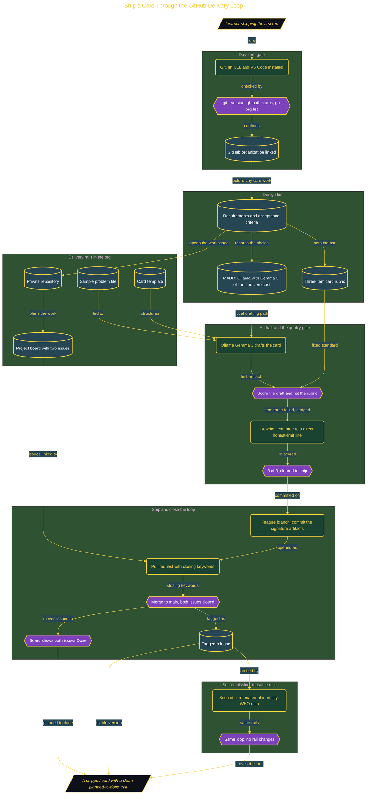

# Ship Your First Card Through GitHub

> Inside the [Build & Brew: The AI Dojo](../../README.md) cohort · *A live build toward the high-performing solutions engineer.*

## Overview

The card is the easy part. This build ships a sourced Global-Problem Card through a full GitHub delivery loop, and the real lesson is the rail system around it: issues, acceptance criteria, rubric checks, a reviewed pull request, and a clean tagged release. Software delivery is not only making an artifact. It is proving how the artifact moved from planned work to finished work, with a trail someone else can inspect.

This is the warm-up rep every later build reuses. The point of view is the high-performing solutions engineer, and the build drills all three cohort reflexes at once: it designs before it builds (requirements, a decision record, and a rubric come first), it proves the result with a fixed rubric rather than a feeling, and it refuses to trust the confident AI answer. The AI drafts the card; the rubric decides whether the draft is allowed to ship.

Primary role: the delivery loop, the DevOps and forward-deployed habits every domain build assumes. It is one live build, with the sample problem, the card template, and the three-item rubric staged so the session spends its attention on the loop, not on setup.

## Architecture

The card only moves once the day-zero gate confirms the machine can talk to GitHub, and it only ships once the AI draft clears the three-item rubric. The same rails then carry a second card with no changes.

The full build write-up, with screenshots and prose as captured during the build, lives in [`documents/ship-your-first-card-through-github.md`](./documents/ship-your-first-card-through-github.md).

## Implementation

The steps below map to the diagram. For the full walkthrough with screenshots, see [`documents/ship-your-first-card-through-github.md`](./documents/ship-your-first-card-through-github.md).

1. Install Git, the GitHub CLI, and VS Code, then run the day-zero gate: `git --version`, `gh auth status`, and `gh org list` confirm the tools work and the organization is linked before any card work starts.
2. Design first: write the requirements and acceptance criteria, a MADR decision record (drafting with Ollama and Gemma 3 for an offline, zero-cost path, with a reversal trigger to a flat-rate client if the machine lacks the RAM or disk), and the three-item rubric.
3. Stand up the rails: create the private repository inside the organization and a Project board with two issues, so the process exists before the draft.
4. Draft with the AI: feed the card template and the sample problem to Ollama and Gemma 3 to produce a structured first draft.
5. Score and gate: check the draft against the rubric. It failed item three on hedged language, so rewrite the softened line into a direct honest-limit statement ("This card does not connect a single offline person") and re-score to 3 of 3.
6. Ship and close the loop: work a feature branch, commit the signature artifacts, open a pull request with closing keywords for both issues, merge to main, and tag the release.
7. Prove reuse: run the secret mission, a second card on maternal mortality verified against the latest World Health Organization data, through the same loop with no rail changes.

## Validation

- ✅ Day-zero gate passes: `git --version`, `gh auth status`, and `gh org list` each return a confirmation before the repository is used.
- ✅ The AI draft is scored against a fixed three-item rubric, not judged by feel.
- ✅ Negative case caught: the draft failed rubric item three on hedged language and was rewritten to a direct honest-limit line, then re-scored to 3 of 3 before merge.
- ✅ The card carries all three required parts: the problem stated plainly, a sourced number with its citation, and an explicit line on what the card does not fix.
- ✅ The repository lives inside the GitHub organization, not a personal account.
- ✅ Both issues are closed by the pull request through closing keywords, and a release is tagged.
- ✅ The Project board shows both issues in Done, from the pull-request linkage rather than a manual status change.
- ✅ Secret mission proves reuse: a second card on a different problem ships through the same loop with no changes to the rails.
