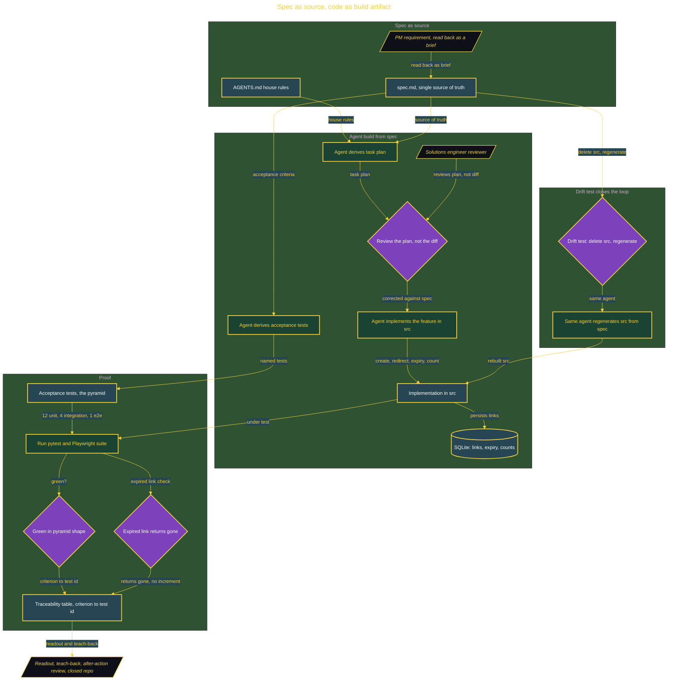

# Spec-Driven Feature Factory

> Inside the [Build & Brew: The AI Dojo](../../README.md) cohort · *A 45-minute live build toward the high-performing solutions engineer.*

## Overview

Last sprint the agent built a feature that demoed beautifully and did the wrong thing, and nobody could say where it went wrong because there was nothing to check it against. The product manager's ask is plain: build the next feature so the requirement is written down first, the agent works from that, and the reviewer checks the plan instead of squinting at a diff.

This build ships a URL shortener with link expiry and per-link click counts, but the feature is the vehicle. The real product is the method: a spec.md that is the single source of truth, an agent that derives the task plan and the acceptance tests from that spec before writing any code, and a review that reads the plan rather than the diff. The code is a build artifact of the spec. The proof is the drift test: delete the source on a scratch branch, regenerate it from spec.md with the same agent, and the untouched test suite must pass with zero edits to any test.

Primary role: AI Integration Engineering, with Software Engineering. Here the AI is the implementer and the spec is the control surface. About 10 to 16 agents work from AGENTS.md and spec.md, and they read the requirement rather than inventing it. Tier: Cohort. It is one live 45-minute build, planned, built, and proven in the room.

## Architecture

The spec drives the plan, the reviewed plan drives the tests and the code, and the drift test closes the loop by regenerating the source from the same spec and running the untouched suite against it.

## Implementation

1. Commit AGENTS.md and spec.md for the URL shortener, write the requirements brief with its FR items and acceptance criteria, the three MADR decision records, and the Mermaid flow diagram, then file five GitHub Issues whose acceptance criteria are copied verbatim from the spec.
2. The agent derives the task plan and the acceptance tests from spec.md; review the plan, not the diff, and correct it against the spec.
3. The agent implements the feature in src against the reviewed plan: create, redirect, expiry, and click count, with links persisted in SQLite and short ids generated as random base62 with a collision check on insert.
4. Build the test pyramid with pytest for the unit and integration layers and Playwright for the one end-to-end, then fill the README traceability table mapping every acceptance criterion to a named test id.
5. Validate: 100 percent of criteria covered by a named test, and the suite green in pyramid shape.
6. Run the drift test while the agent swarm drafts the PM readout, the teach-back, and the after-action review, then close every Issue by pull request and tag the release.

## Validation

✅ Every acceptance criterion in spec.md maps one-to-one to a named test id in the README traceability table, at 100 percent coverage, with no criterion untested and no test tracing to nothing.
✅ The test suite is green in a pyramid shape, for example 12 unit, 4 integration, and 1 end-to-end.
✅ The drift test passes: on a scratch branch, delete the source directory, regenerate it from spec.md with the same agent, and the untouched suite passes with zero edits to any test.
✅ An expired link returns gone and does not increment the click count.
✅ The short-id collision path is a named acceptance test: an insert collision triggers a retry, so the base62 tradeoff is proven rather than asserted.
✅ Every pull request is merged, every Issue on the board is closed, and the release is tagged, with repository documentation present.
