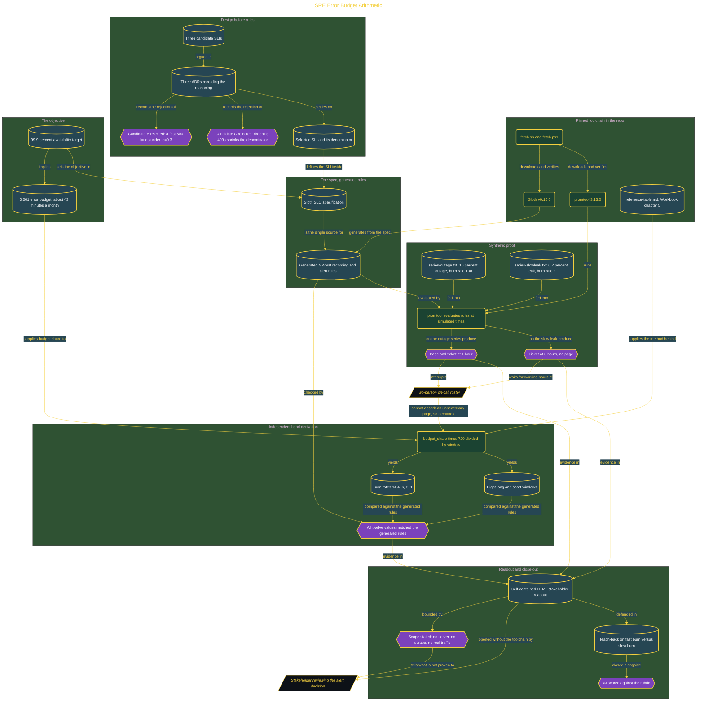

# SRE Error Budget Arithmetic

> Inside the [Build & Brew: The AI Dojo](../../README.md) cohort · *A live build toward the high-performing solutions engineer.*

## Overview

A two-person on-call roster cannot absorb a page that did not need to happen. This build answers the question that decides it: not whether errors exist, because every service produces some, but how fast the current rate is spending the month's error budget. A 99.9% availability target allows about 43 minutes of unavailability a month, and burn rate is the arithmetic that turns that allowance into a defensible page-or-ticket call.

Every threshold is derived by hand before it is trusted. A single Sloth specification generates the multi-window, multi-burn-rate Prometheus rules, and the formula `budget_share * 720 / window` produces 14.4, 6, 3, and 1 independently. All four burn rates and all eight long/short windows matched the generated output, which is what separates a generator following the SRE Workbook method from one applying an unexplained constant. Three candidate SLIs were argued in ADRs first, and two were rejected in writing: latency under 300ms, because a fast 500 response still lands under `le="0.3"` and would count as a good event during an outage, and a variant that dropped 499 responses, because it shrank the denominator exactly when traffic conditions became difficult.

The rules are then proven as behavior rather than asserted as formulas. promtool feeds two synthetic series into the generated rules at simulated times: a 10% outage at burn rate 100 produces both a page and a ticket at the 1-hour evaluation point, and a 0.2% leak at burn rate 2 produces a ticket at 6 hours and pages nobody. The build closes with a self-contained HTML readout a reviewer opens by double-clicking, and it states its own limits plainly. No server ran, no metrics endpoint was scraped, and no real traffic entered the calculations, so this proves configuration behavior under synthetic input, not production readiness.

## Architecture

The diagram shows the topology and data flow of the system as built. The full architectural narrative, with screenshots and prose, lives in [`documents/sre-error-budget-arithmetic.md`](./documents/sre-error-budget-arithmetic.md).

## Implementation

This system is built across **7 phases**:

1. Proving the Rules Work: Test Results and Alert Logic
2. Generating Alert Rules from a Single SLO Spec
3. The Stakeholder Readout: A Self-Contained Proof
4. Why This Project Exists: Roster Math and the Error Budget
5. Setting Up the Toolchain
6. Designing the SLI and Arguing Every Denominator
7. Teaching Burn Rate and Scoring the AI

For the full walkthrough with screenshots and step-by-step content, see [`documents/sre-error-budget-arithmetic.md`](./documents/sre-error-budget-arithmetic.md).

## Validation

Each build phase below is documented in [`documents/sre-error-budget-arithmetic.md`](./documents/sre-error-budget-arithmetic.md), with screenshots, configuration, and notes as captured during the build:

- ✅ Proving the Rules Work: Test Results and Alert Logic
- ✅ Generating Alert Rules from a Single SLO Spec
- ✅ The Stakeholder Readout: A Self-Contained Proof
- ✅ Why This Project Exists: Roster Math and the Error Budget
- ✅ Setting Up the Toolchain
- ✅ Designing the SLI and Arguing Every Denominator
- ✅ Teaching Burn Rate and Scoring the AI
