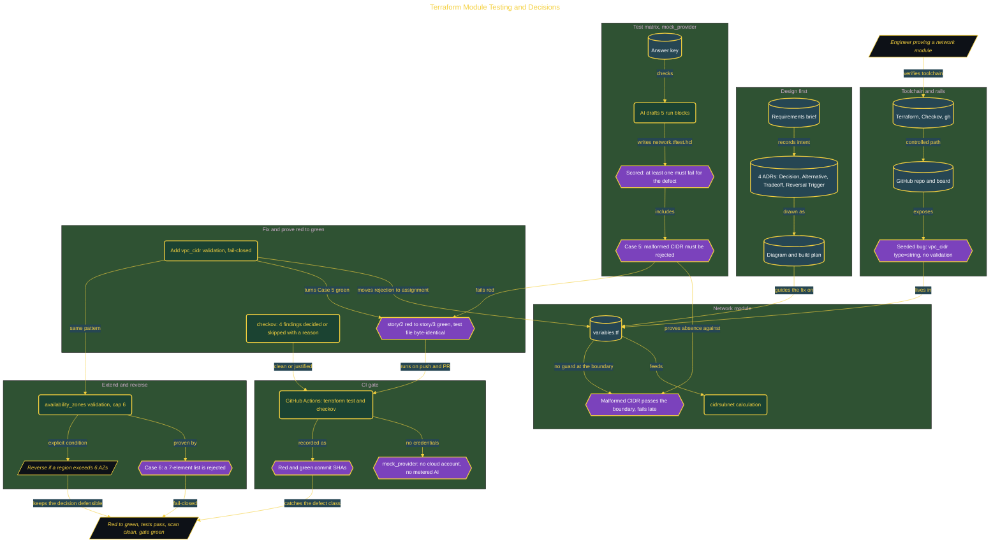

# Terraform Module Testing and Decisions

> Inside the [Build & Brew: The AI Dojo](../../README.md) cohort · *A live build toward the high-performing solutions engineer.*

## Overview

A network module that works is not enough; this build makes one that can be defended. It starts from a Terraform network module with a deliberately seeded bug: `vpc_cidr` is declared as `type = string` with no validation, so a malformed value like `not-a-cidr` passes the module boundary and fails late inside the provider. Checkov does not catch it either, because the gap lives at the input boundary rather than inside a resource policy. The whole build is organized to prove the module fails closed, not that it merely runs.

Design comes before code: a requirements brief, four Architecture Decision Records (each with a Decision, an Alternative, a Tradeoff, and a Reversal Trigger), a diagram, and a plan. An AI-drafted test matrix of five run blocks against `mock_provider` is scored against an answer key, under the hard requirement that at least one test must fail for the existing defect before any fix. Case 5 proves the absence of a boundary guard; adding a `validation` block turns it green with the test file left byte-identical, so the change is provably the module and not the assertion.

Primary role: software and platform engineering. A GitHub Actions gate runs `terraform test` and `checkov` on every push and pull request, with `mock_provider` so it needs no cloud account, no stored credentials, and no metered AI step. The build extends the same fail-closed pattern to an `availability_zones` cap of 6 with an explicit reversal condition, and it records what it deliberately did not prove: real idempotence, left unclaimed because mocks are deterministic but not stateful.

## Architecture

The diagram shows the topology and data flow of the system as built. The full architectural narrative, with screenshots and prose, lives in [`documents/terraform-module-testing-and-decisions.md`](./documents/terraform-module-testing-and-decisions.md).

## Implementation

This system is built across **6 phases**:

1. Setting Up the Development Environment and Identifying the Seeded Bug
2. Designing Before Building: Requirements, ADRs, Diagram, and Plan
3. Drafting the Test Matrix with AI and Scoring the Results
4. Fixing the Module, Passing All Tests, and Scanning Clean
5. Proving the CI Gate, Defending Every Decision, and Closing the Board
6. Extending the Module: Additional Validation and Reversal Triggers

For the full walkthrough with screenshots and step-by-step content, see [`documents/terraform-module-testing-and-decisions.md`](./documents/terraform-module-testing-and-decisions.md).

## Validation

Each build phase below is documented in [`documents/terraform-module-testing-and-decisions.md`](./documents/terraform-module-testing-and-decisions.md), with screenshots, configuration, and notes as captured during the build:

- ✅ Setting Up the Development Environment and Identifying the Seeded Bug
- ✅ Designing Before Building: Requirements, ADRs, Diagram, and Plan
- ✅ Drafting the Test Matrix with AI and Scoring the Results
- ✅ Fixing the Module, Passing All Tests, and Scanning Clean
- ✅ Proving the CI Gate, Defending Every Decision, and Closing the Board
- ✅ Extending the Module: Additional Validation and Reversal Triggers
