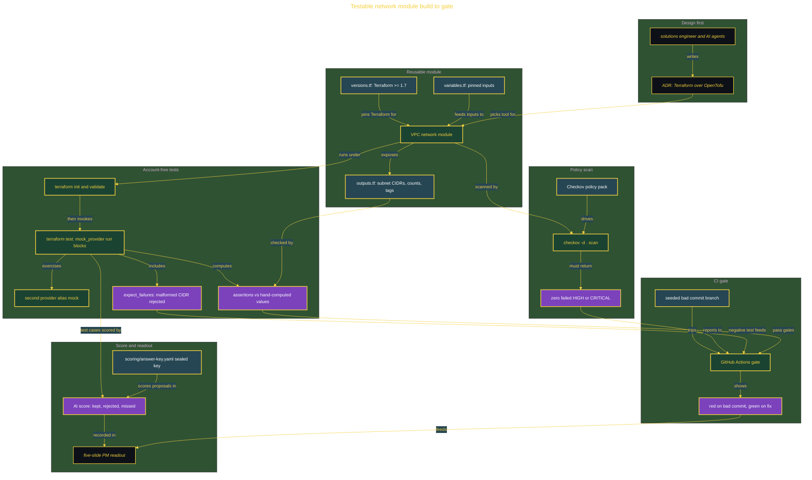

# Testable Multi-Provider Network Module

> Inside the [Build & Brew: The AI Dojo](../../README.md) cohort · *A 45-minute live build toward the high-performing solutions engineer.*

## Overview

A stand-up just ended and the PM stops you on the way out: the team keeps hand-writing network setup, it works on the author's laptop, and nobody can say why the tool was chosen. She wants a reusable network module, tests that prove it, and one page on why you picked your infrastructure tool that she can show the architecture board. You have the rest of the sitting to hand it back reviewable.

This build delivers that. A reusable VPC network module with variables, outputs, and pinned versions; a native `terraform test` suite that runs against a `mock_provider`, so it needs no cloud account and costs nothing; a Checkov policy scan wired into GitHub Actions; and a one-page decision record that picks Terraform 1.7 or newer over OpenTofu and states the license and governance tradeoff out loud. The tests prove the module's validation rules, output math, and policy gate offline. They do not prove live provider integration, deployability, or idempotence, and the decision record names that limit rather than hiding it.

The primary role is Software Engineering and Platform Engineering, at the Cohort tier. It is one live 45-minute build: the slow setup is pre-staged in a starter repo, so the session buys the test matrix and the decision, not the tooling. "Multi-provider" here means the module takes its provider by alias, so one instance can serve more than one region or account.

## Architecture

Design comes before code: the decision record picks the tool, the module exposes its outputs, the mocked tests and the Checkov scan both feed one GitHub Actions gate, and the gate proves itself by going red on a seeded bad commit and green on the fix.

## Implementation

1. Write the three Architecture Decision Records: ADR-01 picks Terraform 1.7 or newer over OpenTofu, ADR-02 picks native `terraform test` with `mock_provider` over LocalStack or a real sandbox account, ADR-03 records that idempotence is deliberately not claimed. Each names the alternative it beat, the tradeoff accepted, and the trigger that would reverse it.
2. Draw the end-to-end topology diagram of the module, its test path, its scan path, and the gate, before writing the plan.
3. Build the VPC network module from the starter skeleton: `variables.tf`, `outputs.tf` for subnet CIDRs, counts, and tags, and `versions.tf` pinning Terraform to >= 1.7, the floor for provider mocking.
4. Draft the `terraform test` matrix with the AI across at least three distinct variable sets, then score its proposed test cases against the sealed answer key at `scoring/answer-key.yaml`.
5. Write the `mock_provider` run blocks: assert each computed output against a hand-computed value, mock a second provider alias to exercise the multi-provider path, and add one `expect_failures` block that proves a malformed CIDR is rejected.
6. Wire the Checkov policy pack: run `checkov -d .` and require zero failed HIGH or CRITICAL checks.
7. Wire the GitHub Actions gate over the tests and the scan, and prove it goes red on the seeded bad commit and green on the fix.
8. Ship through a private GitHub repo (`network-module-testable`) and a GitHub Project board: one epic and five stories (skeleton, test matrix, policy scan, the gate, the readout), each worked on a branch and closed by the pull request that merges it, ending in a tagged release.
9. Present the five-slide PM readout with the tool-decision table, write the teach-back README, and close with the after-action review.

## Validation

- ✅ `terraform init`, `terraform validate`, and `terraform test` pass with 0 failed assertions across a run-block matrix of at least three distinct variable sets.
- ✅ Each assertion checks a computed output against a hand-computed value: the subnet CIDR ranges from `cidrsubnet`, the subnet count per availability zone, and the merged tag map.
- ✅ At least one run block mocks a second provider alias, so the multi-provider path is exercised and not just claimed.
- ✅ One run block uses `expect_failures` to prove the module rejects a malformed CIDR instead of passing it through.
- ✅ `checkov -d .` returns zero failed HIGH or CRITICAL checks.
- ✅ The GitHub Actions gate goes red on the seeded bad commit and green on the fix.
- ✅ The AI score records kept, rejected, and missed test cases against the sealed answer key, with coverage = kept / (kept + missed).
- ✅ The decision record names the boundary: the offline tests do not prove live provider integration, deployability, or idempotence, which need a real plan against real state.
