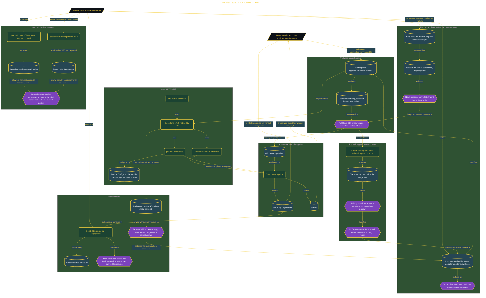

# Build a Typed Crossplane v2 API

> Inside the [Build & Brew: The AI Dojo](../../README.md) cohort · *A live build toward the high-performing solutions engineer.*

## Overview

Asking a developer to hand-assemble a Deployment and a Service for every application is asking them to re-derive the platform's opinions each time, and to get them wrong differently each time. This build replaces that with one namespaced Crossplane v2 API. An ApplicationEnvironment carries application identity, container image, port, and replicas, and a Composition turns an accepted request into the Kubernetes objects behind it through Function Patch and Transform and provider-kubernetes, on a local kind cluster running Crossplane 2.4.0.

The contract came before the implementation, fixing the boundary, the required behaviors, and the evidence that would settle the result, so no later outcome could define its own success. That discipline also governed the AI: the model's proposal was saved unchanged into an evidence file and never converted directly into an XRD, a Composition, or a function, with corrections written separately in the readout. The proposal, the human filter, and the shipped policy stay three visible things rather than one, and an unreviewed answer does not become cluster policy.

Two checks carry the build, testing opposite halves of that contract. Admission proves refusal: an unpinned image tag failed the image rule during a server-side dry run, so nothing was stored and no Deployment or Service work began, which is refusal at the request boundary rather than repair after the fact. Reconciliation proves persistence: deleting the queue-api Deployment returned NotFound while the parent request and the Service stayed in the cluster, and Crossplane restored it to 1/1 with the rollout complete and no second apply. A one-time generator could produce the first Deployment, but it cannot explain the return. The trap sits alongside them, because a legacy v1 XRD passed its own dry run with exit code 0. Admission alone never proves a pattern is current, and only a scope script reading the live XRD and printing Namespaced confirmed the v2 selection.

## Architecture

The diagram shows the topology and data flow of the system as built. The full architectural narrative, with screenshots and prose, lives in [`documents/typed-crossplane-platform-api.md`](./documents/typed-crossplane-platform-api.md).

## Implementation

This system is built across **6 phases**:

1. Reconciling a Healthy Application Environment
2. Enforcing a Typed API with Admission Controls
3. Defining and Preserving the Platform Contract
4. Launching a Healthy Local Control Plane
5. Testing Scope and Refusal Boundaries
6. Building Foundations for a Kubernetes Platform

For the full walkthrough with screenshots and step-by-step content, see [`documents/typed-crossplane-platform-api.md`](./documents/typed-crossplane-platform-api.md).

## Validation

Each build phase below is documented in [`documents/typed-crossplane-platform-api.md`](./documents/typed-crossplane-platform-api.md), with screenshots, configuration, and notes as captured during the build:

- ✅ Reconciling a Healthy Application Environment
- ✅ Enforcing a Typed API with Admission Controls
- ✅ Defining and Preserving the Platform Contract
- ✅ Launching a Healthy Local Control Plane
- ✅ Testing Scope and Refusal Boundaries
- ✅ Building Foundations for a Kubernetes Platform
